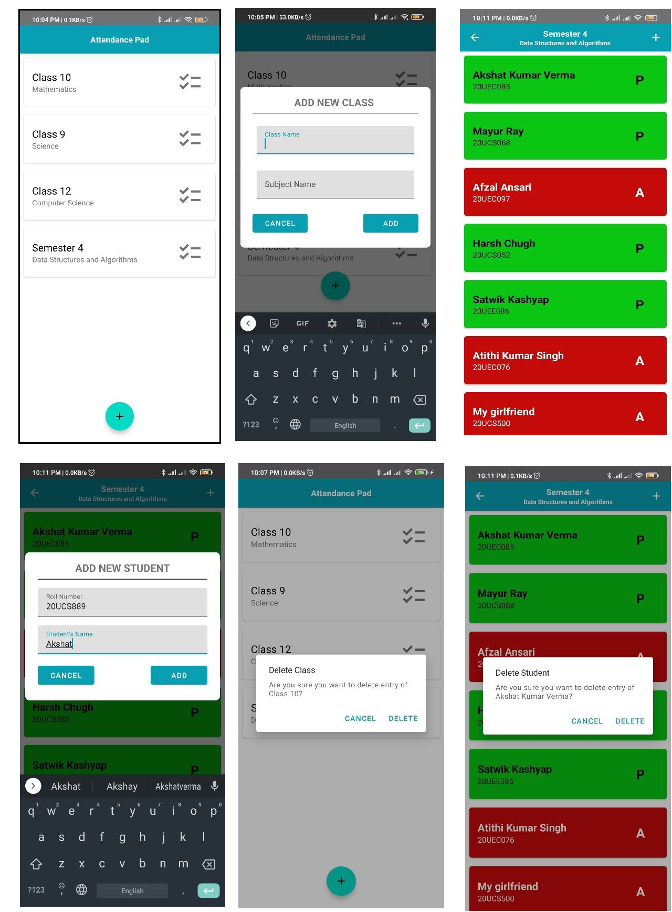
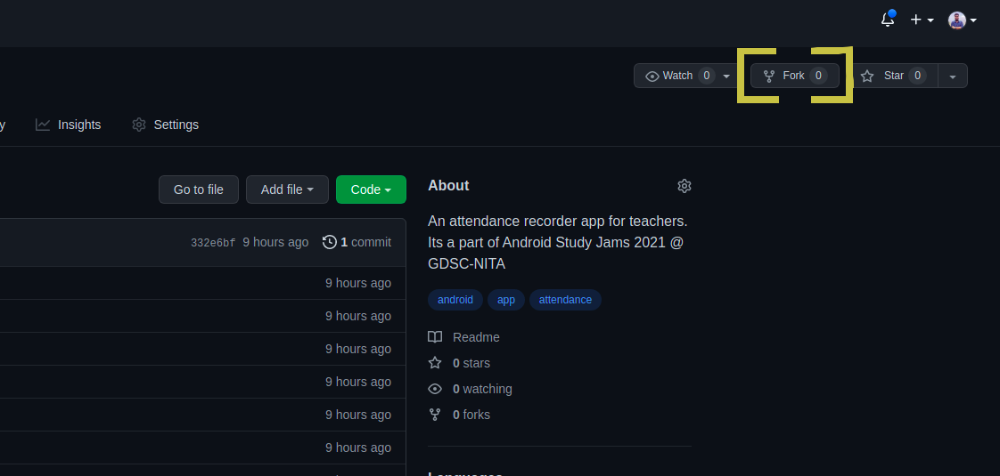
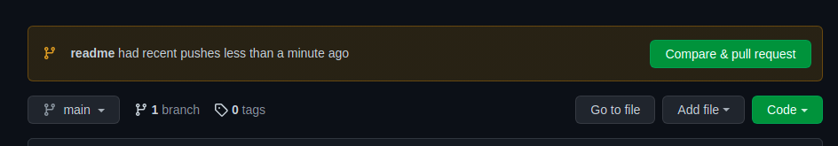
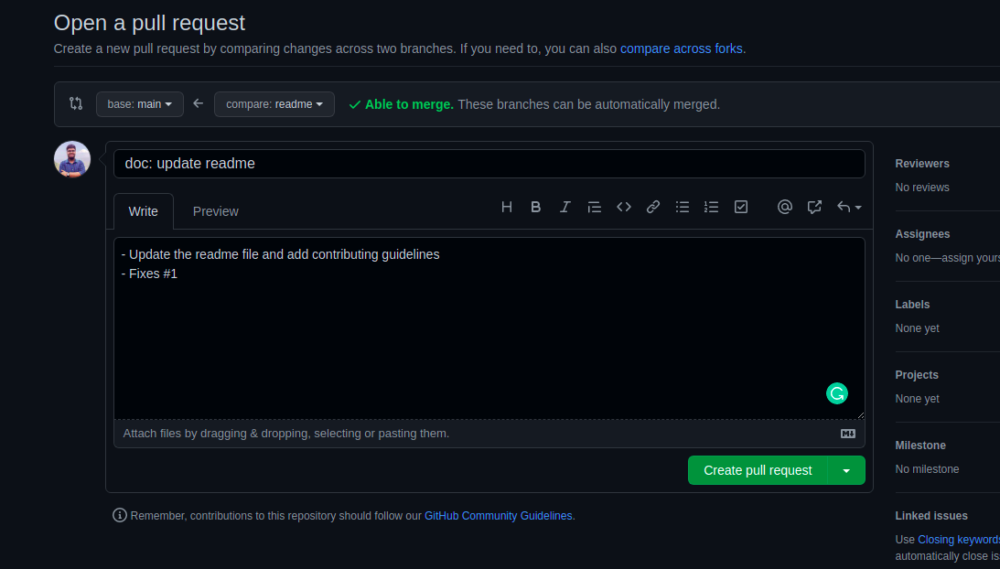

## Attendance-Pad

An attendance recorder app for teachers, build for Android using Kotlin. This project is a part of Android Study Jams 2021 @ GDSC-NITA.

### Problem Statement

The current system requires teachers to carry huge attendance registers for maintaining the record for attendance, which makes the record making cumbersome and also waster paper. This app aims to eliminate the need to maintain attendance registers and make the process digital.

### Proposed Solution :

The project proposes a "Attendance Pad" to keep track of the attendance of students. The app will support to add multiple classes and add multiple students in a particular class. The app will also store the data locally using SQLite.

### Application Screenshots :


### Functionality & Concepts used :
* Jetpack Navigation Component: The application has 2 screens, which was implemented using jetpack navigation component, the application is also using the safe args plugin for passing arguments to other fragment. 
* Constraint Layout : Most of the activities in the app uses a flexible constraint layout, which is easy to handle for different screen sizes. 
* Recycler View: Both the screens of the application uses a recycler view to show a list of required items. 
* LiveData & Room Database: The app persists the data using SQLite using the room api. The viewmodel has live data, which makes the data updation smooth. 
* Simple and easy View Designs: Seperate files for different dialog boxes, most of them using Material Design Guidelines makes the UI for the app smooth.

### Application Link & Future Scope :
You can access the application from [here](https://drive.google.com/file/d/1UIQFQTDx1yQbl3CJSg2xmuWRD-cn_pB0/view?usp=sharing).
We have planned to incluce more functionalities like storing the data on the cloud, in case the user's phone is running low on storage, next the functionality to make PDF for the attendance. 


# Contribution Guidelines

The team wants to make contributing to this project as easy as possible, whether it's:

* Reporting a bug 🐛
* Submitting a fix 🔎
* Proposing new features 💡

This doc contains a set of guidelines to help you during the contribution process. We are happy to welcome all the contributions from anyone willing to improve/add new features to this project.

## Prerequisites

* Download and install the latest version of [Git](https://git-scm.com/downloads).
* Create a [GitHub](https://github.com/join) account.
* Download and install latest version of [Android Studio](https://developer.android.com/studio).

## Project Set Up

1. Fork [this](https://github.com/DSC-NITA/attendancepad) repository



2. Clone the forked repository

```bash
git clone https://github.com/<your-github-username>/attendancepad.git
```

3. Navigate to the project directory

```bash
cd attendancepad
```

4. Add reference to the original repository

```bash
git remote add upstream https://github.com/DSC-NITA/attendancepad.git
```

5. Always take a pull from the upstream repository to your `main` branch to keep it at par with the main project(updated repository).

```bash
git pull upstream main
```

Once done with the above steps you are good to go for contributing. See the section below for more details.

## Contributing To The Project

1. Create a new branch (**DO NOT** name it MAIN or MASTER or anything random).

```bash
git checkout -b <your_branch_name>
```

2. Perfom your desired changes to the code base.

    * Make sure that you do not change any code unrelated to the task that you have been assigned
    * Preview your changes and test them properly before proceding ahead.

3. Add your changes to the project's version control

```bash
git add .
```

4. Commit your changes

```bash
git commit -m "Your commit message"
```

5. Push the committed changes in your feature branch to your remote repo.

```bash
git push -u origin <your_branch_name>
```

6. To create a pull request, click on `compare and pull requests`. Please ensure you compare your feature branch to the desired branch of the repo you are suppose to make a PR to.



7. Then add an appropriate title and description to your pull request that explains your changes and efforts done.

8. Click on `Create Pull Request`.

    * Make sure to refer the respective issue in the respective PR using phrases like Resolves #issue_number or Closes #issue_number or Fixes #issue_number. Here's an example to raise a PR:

```markdown
 Fixes #21

# Work Done:

- Fixed home-page renderning and jagging issue
- ...
- ...
- ...

# Relevant Screenshots/Gifs
```



9. Wo-Hoo!! You have made an PR to the attendance-pad app. Sit back and relax while the maintainers review the PR.
